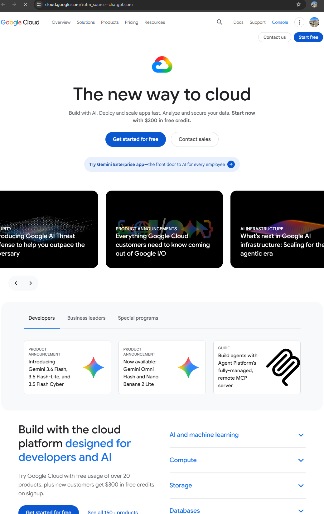

# Google Cloud Platform (GCP) Research

## Brief Overview

Google Cloud Platform (GCP) is a cloud computing platform provided by Google. It offers services for computing, storage, databases, networking, artificial intelligence, machine learning, analytics, and application development.

## Global Infrastructure

Google Cloud organizes its infrastructure into regions and zones around the world. Regions are geographic areas containing multiple zones, while zones provide separate deployment locations that can help improve availability and fault tolerance.

## Cloud Management Console

The Google Cloud Console is a web-based interface used to create, configure, monitor, and manage Google Cloud resources and services.

## Four Core Services

### 1. Compute Engine

Compute Engine provides virtual machines that can be used to run applications and workloads.

### 2. Cloud Storage

Cloud Storage provides scalable object storage for files, backups, media, and other data.

### 3. Cloud SQL

Cloud SQL is a managed relational database service for databases such as MySQL and PostgreSQL.

### 4. Google Kubernetes Engine

Google Kubernetes Engine (GKE) is a managed Kubernetes service used to deploy and manage containerized applications.

## Three Advantages

1. GCP provides strong capabilities for artificial intelligence, machine learning, and data analytics.
2. Its global infrastructure supports applications that require scalability and availability.
3. GCP provides managed services that reduce the amount of infrastructure maintenance required by organizations.

## Typical Enterprise Use Cases

GCP can be used for web applications, data analytics, artificial intelligence and machine learning, containerized applications, databases, backup, and large-scale enterprise workloads.

## Screenshot Evidence

## Official Sources

- Google Cloud
- Google Cloud Documentation
- Google Cloud Console
